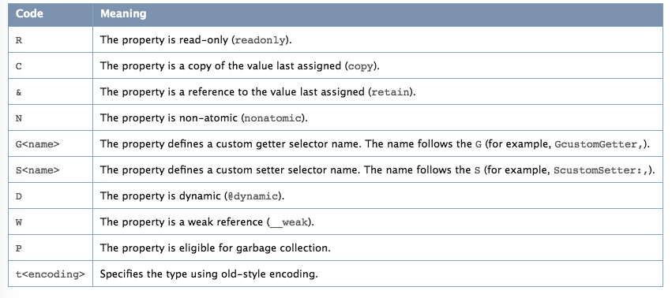

# <center>TypeEncodings And Declared Properties</center>

## Objective-C type encodings

为了协助运行时系统，编译器会对每个方法的参数及返回值类型进行编码 并对对应方法的 ```method selector```进行关联,。它使用的编码方案在其他上下文中也很有用，并且可以使用@encode()编译器指令公开。当给定类型声明时，@encode()返回编码该类型的字符串。类型可以是基本类型，例如int，指针，结构体，或类名等


## Objective-C method encodings


## Declared Properties


### Declared property type encodings


### Property Attribute Description Examples
```
The string starts with a T followed by the @encode type and a comma, and
finishes with a V followed by the name of the backing instance variable.
Between these, the attributes are specified by the following descriptors,
separated by commas:

```


- [参考文档 - Type Encodings](https://developer.apple.com/library/archive/documentation/Cocoa/Conceptual/ObjCRuntimeGuide/Articles/ocrtTypeEncodings.html#//apple_ref/doc/uid/TP40008048-CH100-SW1)
- [参考文档 - Declared Properties](https://developer.apple.com/library/archive/documentation/Cocoa/Conceptual/ObjCRuntimeGuide/Articles/ocrtPropertyIntrospection.html#//apple_ref/doc/uid/TP40008048-CH101-SW1)