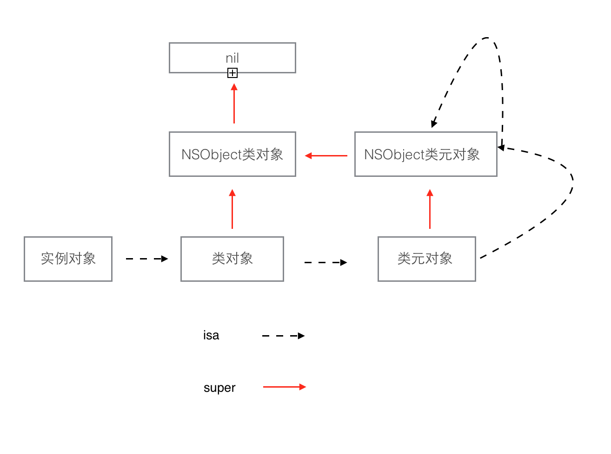

# <center>some points</center>

## 一对宏

NS_ASSUME_NONNULL_BEGIN / NS_ASSUME_NONNULL_END

为了防止写一大堆 ```nonnull```(不可为nil)，```Foundation``` 还提供了一对儿宏，包在里面的对象默认加 ```nonnull``` 修饰符，只需要把 ```nullable``` 的指出来就行.

```
#import <JSONModel/JSONModelLib.h>

NS_ASSUME_NONNULL_BEGIN

@interface CLAssetItem : JSONModel
@property (nonatomic, copy) NSString *symbol;
@property (nonatomic, assign) float amount;
@end

NS_ASSUME_NONNULL_END
```


## 内联函数

```
#define force_inline inline attribute((always_inline))

```

 ``` __attribute__((always_inline)) ```的意思是强制内联，所有加了 ``` __attribute__((always_inline)) ```的函数再被调用时不会被编译成函数调用而是直接扩展到调用函数体内 

```
比如定义了函数
 __attribute__((always_inline)) void a()
 void b()｛a();｝
 b调用a函数的汇编代码不会是跳转到a执行，而是a函数的代码直接在b内成为b的一部分。
```


普通函数:
- 调用时，会出现流程跳转
- 首先跳到被调用函数
- 被调用函数执行完之后，又会跳会主调函数中

内联函数:
- 调用时，直接 将内联函数的代码全部复制到调用的地点；
- 内联函数的定义必须出现在调用之前；
- 牺牲内存空间，来提高函数执行速度；

内联函数的不足:

- 通常，编译器比程序设计者更清楚对于一个特定的函数是否合适进行内联扩展；一些情况下，对于程序员指定的某些内联函数，编译器可能更倾向于不使用内联甚至根本无法完成内联。
- 代码比较长的，即使声明为inline，也不会最终内联
- 而有的一些比较短的小函数，即使没有声明inline，也会由c/c++编译器最终内联
- 对于一些开发中的函数，它们可能从原来的不适合内联扩展变得适合或者倒过来。尽管内联函数或者非内联函数的转换易于宏的转换，但增加的维护开支还是使得它的优点显得更不突出了。
- 对于基于C的编译系统，内联函数的使用可能大大增加编译时间，因为每个调用该函数的地方都需要替换成函数体，代码量的增加也同时带来了潜在的编译时间的增加。

```
note: 而如果函数使用强制内联，那么最终就一定是内联
```

## @package 关键字

@package变量，对于framework内部，相当于@protected， 对于framework外部，相当于@privat。
这个特性，很适合用于开发第三方的静态类库，因为多数人并不希望让别人知道自己属性的值。

[参考文档](https://blog.csdn.net/kaiyuanheshang/article/details/73166802)

## .(点）和->（箭头）的区别

``` .(点语法） ```是访问类的属性，本质是调用set、get方法。
``` -> (箭头) ```是访问成员变量，但成员变量默认受保护，所以常常报错，手动设为public即可解决

## meta class


类对象的定义

```

typedef struct objc_class *Class;

struct objc_class {
    Class isa  OBJC_ISA_AVAILABILITY;

#if !__OBJC2__
    Class super_class                                        OBJC2_UNAVAILABLE;
    const char *name                                         OBJC2_UNAVAILABLE;
    long version                                             OBJC2_UNAVAILABLE;
    long info                                                OBJC2_UNAVAILABLE;
    long instance_size                                       OBJC2_UNAVAILABLE;
    struct objc_ivar_list *ivars                             OBJC2_UNAVAILABLE;
    struct objc_method_list **methodLists                    OBJC2_UNAVAILABLE;
    struct objc_cache *cache                                 OBJC2_UNAVAILABLE;
    struct objc_protocol_list *protocols                     OBJC2_UNAVAILABLE;
#endif

} OBJC2_UNAVAILABLE;

```

id类型中存在一个可以找到类对象的指针,id定义:

```

typedef struct objc_object *id;
struct objc_object {
    Class isa  OBJC_ISA_AVAILABILITY;
}

```


OC的对象通过isa找到类对象, 实例对象由类对象创建，类对象保存了实例对象的方法列表

类对象由类元对象创建, 保存了类对象的方法列表


### 实例对象 类 元类 及其继承关系 如图:



### a simple example

```
CustomObject * obj = [[CustomObject alloc] init];
```

- alloc是类方法，沿着isa找到CustomObject类元对象，发现没有实现alloc
- 沿着super，找到NSObject类元方法，执行alloc方法，并把alloc加入到NSObject类元对象的Class Cache中
- init是实例方法，沿着isa找到CustomObject的类对象，发现没有实现init
- 沿着super，找到NSObject类对象，执行init，并把init加入到NSObject的类对象Class Cache中
--------------------- 
[参考](https://blog.csdn.net/hello_hwc/article/details/49682857)
[原创博客](https://blog.csdn.net/hello_hwc/article/details/49682857)


