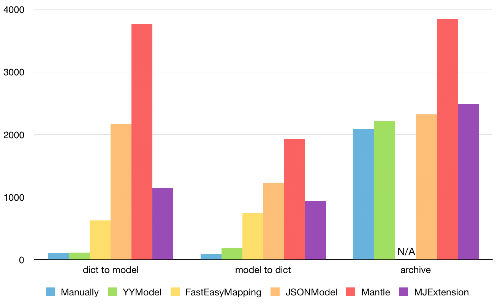

# 
Why YY faster

## performance

Time cost (process GithubUser 10000 times on iPhone 6):

Features
- High performance: The conversion performance is close to handwriting code.
- Automatic type conversion: The object types can be automatically converted.
- Type Safe: All data types will be verified to ensure type-safe during the conversion process.
- Non-intrusive: There is no need to make the model class inherit from other base class.
- Lightwight: This library contains only 5 files.
Docs and unit testing: 100% docs coverage, 99.6% code coverage.

## some tips

- 缓存Model JSON 转换过程中需要很多类的元数据，如果数据足够小，则全部缓存到内存中。

- 查表当遇到多项选择的条件时，要尽量使用查表法实现，比如 switch/case，C Array，如果查表条件是对象，则可以用 NSDictionary 来实现。

- 避免 KVCKey-Value Coding 使用起来非常方便，但性能上要差于直接调用 Getter/Setter，所以如果能避免 KVC 而用 Getter/Setter 代替，性能会有较大提升。

- 避免 Getter/Setter 调用如果能直接访问 ivar，则尽量使用 ivar 而不要使用 Getter/Setter 这样也能节省一部分开销。

- 避免多余的内存管理方法在 ARC 条件下，默认声明的对象是 strong 类型的，赋值时有可能会产生 retain/release 调用，如果一个变量在其生命周期内不会被释放，则使用 unsafe_unretained 会节省很大的开销。访问具有 weak 属性的变量时，实际上会调用 objc_loadWeak() 和 objc_storeWeak() 来完成，这也会带来很大的开销，所以要避免使用 weak 属性。创建和使用对象时，要尽量避免对象进入 autoreleasepool，以避免额外的资源开销。

- 遍历容器类时，选择更高效的方法相对于 Foundation 的方法来说，CoreFoundation 的方法有更高的性能，用 CFArrayApplyFunction() 和 CFDictionaryApplyFunction() 方法来遍历容器类能带来不少性能提升，但代码写起来会非常麻烦。

- 尽量用纯 C 函数、内联函数使用纯 C 函数可以避免 ObjC 的消息发送带来的开销。如果 C 函数比较小，使用 inline 可以避免一部分压栈弹栈等函数调用的开销。

- 减少遍历的循环次数在 JSON 和 Model 转换前，Model 的属性个数和 JSON 的属性个数都是已知的，这时选择数量较少的那一方进行遍历，会节省很多时间

[参考文档 github YYModel](https://github.com/ibireme/YYModel)

[参考文档 Full API documentation cocoaDocs](http://cocoadocs.org/docsets/YYModel/)

[参考文档 iOS JSON 模型转换库评测](https://blog.ibireme.com/2015/10/23/ios_model_framework_benchmark/)

[参考文档 YYModel 源码剖析：关注性能](https://www.jianshu.com/p/fe30e6bbc551)

[评测 代码 https://github.com/ibireme/YYModel/tree/master/Benchmark](https://github.com/ibireme/YYModel/tree/master/Benchmark)

